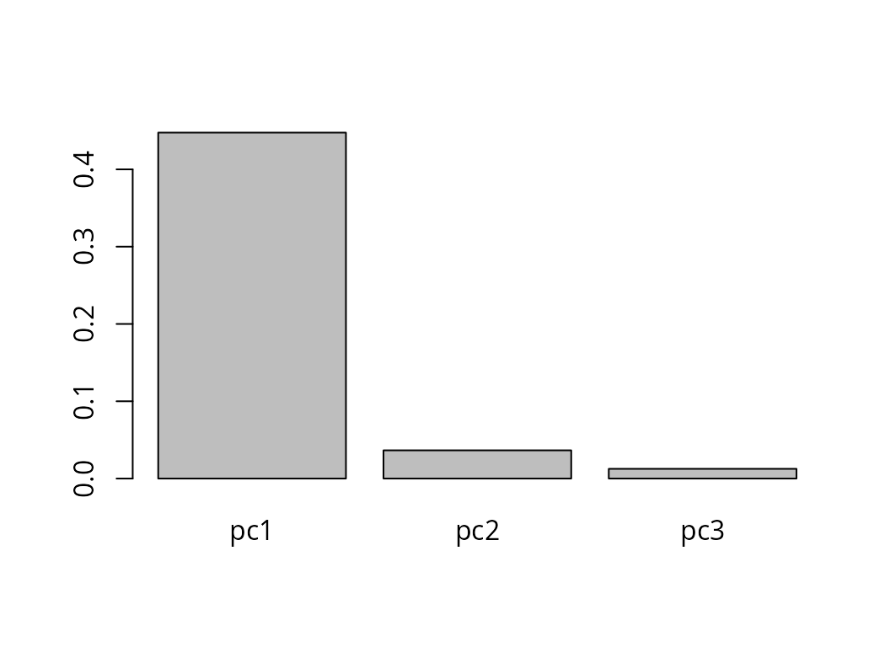
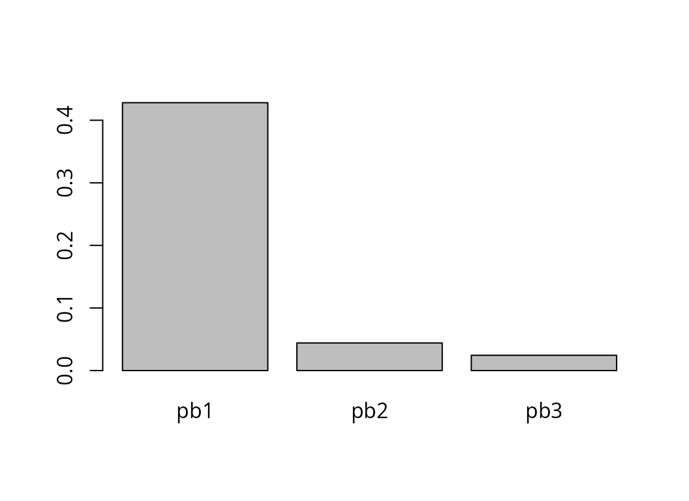

# Working with log-ratio coordinates in \`coda.base\`

In this vignette we show how to define log-ratio coordinates using
`coda.base` package and its function `coordinates` with parameters `X`,
a composition, and `basis`, defining the independent log-contrasts for
building the coordinates.

In this vignette we work with a subcomposition of the results obtained
in different regions of Catalonia in 2017’s parliament elections:

``` r
library(coda.base)
data('parliament2017')
X = parliament2017[,c('erc','jxcat','psc','cs')]
```

## Log-ratio coordinates with `coda.base`

### The additive logratio (alr) coordinates

The alr coordinates are accessible by setting the parameter
`basis='alr'` or by using the building function
[`alr_basis()`](https://mcomas.net/coda.base/reference/alr_basis.md).

If you don’t want the last part in the denominator, the easiest way to
define an alr-coordinates is to set `basis='alr'`:

``` r
H1.alr = coordinates(X, basis = 'alr')
head(H1.alr)
#>          alr1        alr2       alr3
#> 1  0.23864536 0.446503630 -0.7201917
#> 2 -0.10388120 0.216858085 -1.0473730
#> 3  0.36723896 0.542010167 -0.5320675
#> 4  0.53209369 0.798479995 -0.4799141
#> 5  0.54918649 0.477309280 -0.1028807
#> 6 -0.09742133 0.002856425 -0.6858265
```

It defines an alr-coordinates were the last part is used in the
denominator. The basis used to build `H1.alr` can be obtained with the
function `alr_bases()`:

``` r
alr_basis(X)
#>       alr1 alr2 alr3
#> erc      1    0    0
#> jxcat    0    1    0
#> psc      0    0    1
#> cs      -1   -1   -1
```

In fact, function `alr_basis` allows to define any type of alr-like
coordinate by defining the numerator and the denominator:

``` r
B.alr = alr_basis(X, numerator = c(4,2,3), denominator = 1)
B.alr
#>       alr1 alr2 alr3
#> erc     -1   -1   -1
#> jxcat    0    1    0
#> psc      0    0    1
#> cs       1    0    0
```

The log-contrast matrix can be used as `basis` parameter in
[`coordinates()`](https://mcomas.net/coda.base/reference/coordinates.md)
function:

``` r
H2.alr = coordinates(X, basis = B.alr)
head(H2.alr)
#>          alr1        alr2       alr3
#> 1 -0.23864536  0.20785827 -0.9588371
#> 2  0.10388120  0.32073928 -0.9434918
#> 3 -0.36723896  0.17477121 -0.8993065
#> 4 -0.53209369  0.26638630 -1.0120078
#> 5 -0.54918649 -0.07187721 -0.6520672
#> 6  0.09742133  0.10027776 -0.5884051
```

### The centered logratio (clr) coordinates

Building centered log-ratio coordinates can be accomplished by setting
parameter `basis='clr'` or

``` r
H.clr = coordinates(X, basis = 'clr')
head(H.clr)
#>         clr1      clr2       clr3         clr4
#> 1 0.24740605 0.4552643 -0.7114311  0.008760689
#> 2 0.12971783 0.4504571 -0.8137740  0.233599031
#> 3 0.27294355 0.4477148 -0.6263629 -0.094295406
#> 4 0.31942879 0.5858151 -0.6925790 -0.212664904
#> 5 0.31828271 0.2464055 -0.3337844 -0.230903777
#> 6 0.09767651 0.1979543 -0.4907286  0.195097842
```

### The isometric logratio (ilr) coordinates

`coda.base` allows to define a wide variety of ilr-coordinates:
principal components (pc) coordinates, specific user balances
coordinates, principal balances (pb) coordinates, balanced coordinates
(default’s [CoDaPack](https://imae.udg.edu/codapack/)’s coordinates).

The default ilr coordinate used by `coda.base` are accessible by simply
calling function `coordinates` without parameters:

``` r
H1.ilr = coordinates(X)
head(H1.ilr)
#>          ilr1      ilr2        ilr3
#> 1 -0.14697799 0.8677450 -0.01011597
#> 2 -0.22679692 0.9012991 -0.26973693
#> 3 -0.12358191 0.8056307  0.10888296
#> 4 -0.18836356 0.9350526  0.24556428
#> 5  0.05082486 0.5030669  0.26662472
#> 6 -0.07090708 0.5213690 -0.22527958
```

Parameter `basis` is set to `ilr` by default:

``` r
all.equal( coordinates(X, basis = 'ilr'),
           H1.ilr )
#> [1] TRUE
```

### Other ilr-coordinates: Principal Components and Principal balances

Other easily accessible coordinates are the Principal Component (PC)
coordinates. PC coordinates define the first coordinate as the
log-contrast with the highest variance, the second the one independent
of the first and with the highest variance and so on:

``` r
H2.ilr = coordinates(X, basis = 'pc')
head(H2.ilr)
#>          pc1         pc2       pc3
#> 1 -0.6787536  0.35694598 0.4319368
#> 2 -0.5581520  0.57775877 0.5396259
#> 3 -0.7013616  0.25302877 0.3467523
#> 4 -0.8973701  0.25915667 0.3125234
#> 5 -0.5362270 -0.05527103 0.1901418
#> 6 -0.2676101  0.32802497 0.3852126
barplot(apply(H2.ilr, 2, var))
```



Note that the PC coordinates are independent:

``` r
cov(H2.ilr)
#>               pc1           pc2           pc3
#> pc1  4.475083e-01 -8.279305e-17 -1.474304e-16
#> pc2 -8.279305e-17  3.650673e-02  1.498644e-17
#> pc3 -1.474304e-16  1.498644e-17  1.257989e-02
```

The Principal Balance coordinates are similar to PC coordinates but with
the restriction that the log contrast are balances

``` r
H3.ilr = coordinates(X, basis = 'pb')
head(H3.ilr)
#>          pb1         pb2         pb3
#> 1 -0.7026704 -0.14697799 -0.50925247
#> 2 -0.5801749 -0.22679692 -0.74060456
#> 3 -0.7206583 -0.12358191 -0.37622854
#> 4 -0.9052439 -0.18836356 -0.33935049
#> 5 -0.5646882  0.05082486 -0.07274761
#> 6 -0.2956308 -0.07090708 -0.48495254
barplot(apply(H3.ilr, 2, var))
```



Moreover, they are not independent:

``` r
cor(H3.ilr)
#>            pb1       pb2        pb3
#> pb1  1.0000000 0.6043786 -0.3197742
#> pb2  0.6043786 1.0000000  0.1594538
#> pb3 -0.3197742 0.1594538  1.0000000
```

Principal Balances are challenging to compute when the number of
components is very high. `coda.base` allows building PB approximations
using different algorithms.

``` r
X100 = exp(matrix(rnorm(1000*100), ncol = 100))
```

- *Hierarchical clustering based algorithm*.

``` r
PB1.ward = pb_basis(X100, method = 'cluster')
```

- *Constrained search algorithm*

``` r
PB1.constrained = pb_basis(X100, method = 'constrained')
```

We can compare their performance (variance explained by the first
balance) with respect to the principal components.

``` r
PC_approx = coordinates(X100, cbind(pc_basis(X100)[,1], PB1.ward[,1], PB1.constrained[,1]))
names(PC_approx) = c('PC', 'Ward', 'Constrained')
apply(PC_approx, 2, var)
#>       h1       h2       h3 
#> 1.731923 1.300759 1.618651
```

Finally, `coda.base` allows to define the default CoDaPack basis which
consists in defining well balanced balances, i.e. equal number of
branches in each balance.

``` r
H4.ilr = coordinates(X, basis = 'cdp')
head(H4.ilr)
#>        ilr1        ilr2        ilr3
#> 1 0.7026704 -0.14697799 -0.50925247
#> 2 0.5801749 -0.22679692 -0.74060456
#> 3 0.7206583 -0.12358191 -0.37622854
#> 4 0.9052439 -0.18836356 -0.33935049
#> 5 0.5646882  0.05082486 -0.07274761
#> 6 0.2956308 -0.07090708 -0.48495254
```

## Defining coordinates manually

### Defining coordinates with an specific basis

We can define the coordinates directly by providing the log-contrast
matrix.

``` r
B = matrix(c(-1,-1,2,0,
             1,0,-0.5,-0.5,
             -0.5,0.5,0,0), ncol = 3)
H1.man = coordinates(X, basis = B)
head(H1.man)
#>          h1        h2          h3
#> 1 -2.125532 0.5987412  0.10392914
#> 2 -2.207723 0.4198053  0.16036964
#> 3 -1.973384 0.6332727  0.08738560
#> 4 -2.290402 0.7720507  0.13319315
#> 5 -1.232257 0.6006268 -0.03593861
#> 6 -1.277088 0.2454919  0.05013888
```

### Defining coordinates using balances

We can also define balances using formula `numerator~denominator`:

``` r
B.man = sbp_basis(list(b1 = erc~jxcat,
                       b2 = psc~cs,
                       b3 = erc+jxcat~psc+cs), 
                  data=X)
H2.man = coordinates(X, basis = B.man)
head(H2.man)
#>            b1          b2        b3
#> 1 -0.14697799 -0.50925247 0.7026704
#> 2 -0.22679692 -0.74060456 0.5801749
#> 3 -0.12358191 -0.37622854 0.7206583
#> 4 -0.18836356 -0.33935049 0.9052439
#> 5  0.05082486 -0.07274761 0.5646882
#> 6 -0.07090708 -0.48495254 0.2956308
```

With `sbp_basis` we do not need to define neither a basis nor a system
generator

``` r
B = sbp_basis(list(b1 = erc+jxcat~psc+cs), 
              data=X)
#> Warning in sbp_basis(list(b1 = erc + jxcat ~ psc + cs), data = X):
#> Given partition is not a basis
H3.man = coordinates(X, basis = B)
head(H3.man)
#>          b1
#> 1 0.7026704
#> 2 0.5801749
#> 3 0.7206583
#> 4 0.9052439
#> 5 0.5646882
#> 6 0.2956308
```

or

``` r
B = sbp_basis(list(b1 = erc~jxcat+psc~cs, 
                   b2 = jxcat~erc+psc+cs,
                   b3 = psc~erc+jxcat+cs,
                   b4 = cs~erc+jxcat+psc),
              data=X)
#> Warning in sbp_basis(list(b1 = erc ~ jxcat + psc ~ cs, b2 = jxcat ~
#> erc + : Given basis is not orthogonal
H4.man = coordinates(X, basis = B)
head(H4.man)
#>            b1        b2         b3          b4
#> 1 -0.01011597 0.5256940 -0.8214898  0.01011597
#> 2 -0.26973693 0.5201431 -0.9396653  0.26973693
#> 3  0.10888296 0.5169765 -0.7232616 -0.10888296
#> 4  0.24556428 0.6764410 -0.7997213 -0.24556428
#> 5  0.26662472 0.2845246 -0.3854211 -0.26662472
#> 6 -0.22527958 0.2285779 -0.5666446  0.22527958
```

If interested, we can complete a sequential binary partition giving only
some partitions

``` r
B = sbp_basis(list(b1 = erc+jxcat~psc), 
              data=X, fill = TRUE)
sign(B)
#>       b1 .b2 .b3
#> erc    1   1   1
#> jxcat  1   1  -1
#> psc   -1   1   0
#> cs     0  -1   0
```

We can also define sequential binary partition using a matrix. By using
a matrix we don’t need to include a dataset. The number of components is
obtained with the number of rows and component names from row names (if
available).

``` r
P =  matrix(c(1, 1,-1,-1,
              1,-1, 0, 0,
              0, 0, 1,-1), ncol= 3)
B = sbp_basis(P)
H5.man = coordinates(X, basis = B)
head(H5.man)
#>          b1          b2          b3
#> 1 0.7026704 -0.14697799 -0.50925247
#> 2 0.5801749 -0.22679692 -0.74060456
#> 3 0.7206583 -0.12358191 -0.37622854
#> 4 0.9052439 -0.18836356 -0.33935049
#> 5 0.5646882  0.05082486 -0.07274761
#> 6 0.2956308 -0.07090708 -0.48495254
```
