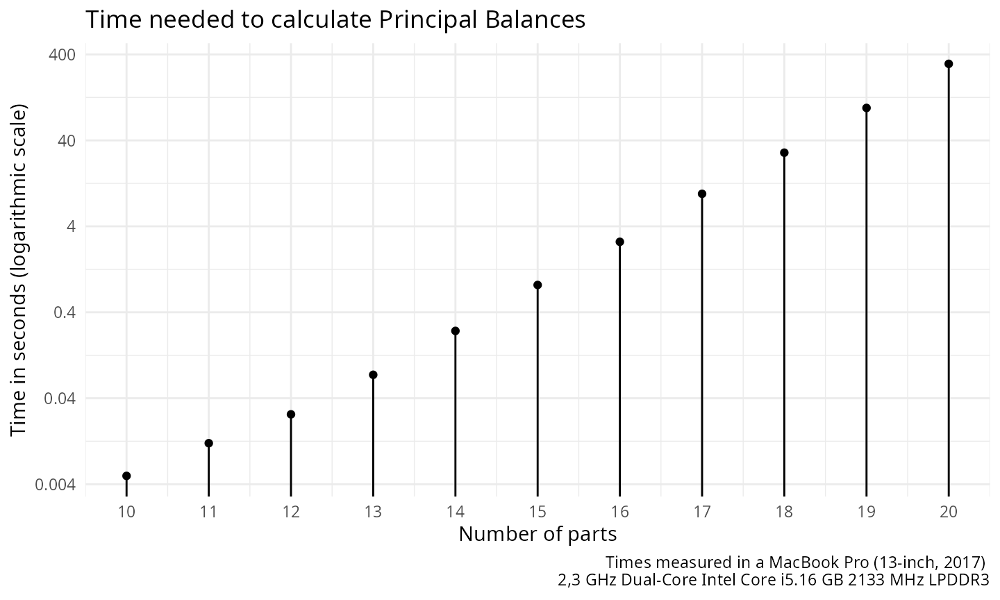

# Principal Balances

*Principal balances* are defined as follows (Pawlowsky-Glahn, Egozcue,
and Tolosan-Delgado 2011):

> Given an $`n`$-sample of a $`D`$-part random composition, the set of
> Principal Balances (PB) is a set of $`D-1`$ balances satisfying the
> following conditions:
>
> - Each sample PB is obtained as the projection of a sample composition
>   on a unitary composition or balancing element associated to the PB.
> - The first PB is the balance with maximum sample variance.
> - The $`i`$-th PB has maximum variance conditional to its balancing
>   element being orthogonal to the previous 1st, 2nd, …, $`(i-1)`$-th
>   balancing elements.

Because of the large number of possibilities, for a given compositional
sample, finding the PB is a computational demanding task.
Martín-Fernández et al. (2017) proposed different approaches to deal
with the calculation and approximation of such type of basis.
`coda.base` implements all methods presented in (Martín-Fernández et al.
2017).

To illustrate `coda.base` functionalities, we use the following dataset:

``` r
library(coda.base)
#> 
#> Attaching package: 'coda.base'
#> The following object is masked from 'package:stats':
#> 
#>     dist
X = parliament2017[,-1]
```

consisting of parties in the 2017 Catalan Parliament Elections.

### Exact Principal Balances

`coda.base` can calculate the PB with the function
[`pb_basis()`](https://mcomas.net/coda.base/reference/pb_basis.md).
Function
[`pb_basis()`](https://mcomas.net/coda.base/reference/pb_basis.md) needs
the parameter `method` to be set. To obtain the PB users needs to set
`method = "exact"`.

``` r
B1 = pb_basis(X, method = "exact")
```

Where the obtained sequential binary partition can be summarized with
the following sequential binary tree:

``` r
plot_balance(B1)
```


``` r
apply(coordinates(X, B1), 2, var)
#>      pb1      pb2      pb3      pb4      pb5      pb6      pb7 
#> 0.663216 0.085733 0.046135 0.044113 0.032890 0.028590 0.008179
```

When `method` is set to `"exact"`, exhaustive search is performed to
obtain the PB. The time needed to calculate the PB grows exponentially
regarding the number of parts of `X`. To iterate through all the
possibilities, CoDaPack uses the algorithm Ruskey (1993). Currently,
exhaustive search can find the PB of a compositional data set with 20
parts in a reasonable amount of time (5 minutes approximately).



When the number of part is higher, the exact method should be discarded
in favor of other alternatives. Different alternatives are available in
Pawlowsky-Glahn, Egozcue, and Tolosan-Delgado (2011) and
Martín-Fernández et al. (2017). Between these alternatives, the once
that can be implemented are agglomerate partition approach based on the
Ward method Martín-Fernández et al. (2017) and the approximation based
on a reduced approximation to the principal components (Martín-Fernández
et al. 2017).

### Ward Method for Parts

For a composition $`X`$, Pawlowsky-Glahn, Egozcue, and Tolosan-Delgado
(2011) proposed to build the variation array and use it to produce a
matrix distance. The variation array calculates the variance between a
pair of logratios.

``` r
D = as.dist(variation_array(X))
D
#>            cs   jxcat     erc     psc   catsp     cup      pp
#> jxcat 0.62079                                                
#> erc   0.39636 0.08823                                        
#> psc   0.04887 0.53876 0.29338                                
#> catsp 0.06682 0.54951 0.29768 0.01636                        
#> cup   0.48118 0.07179 0.05809 0.36163 0.35432                
#> pp    0.12424 0.40944 0.20351 0.10318 0.14361 0.32193        
#> other 0.07018 0.56344 0.36363 0.07197 0.07462 0.37428 0.20308
```

Combining pairs with lower variance, it is expected to get a final
merging with high variability.

``` r
B2 = pb_basis(X, method = 'cluster')
plot_balance(B2)
```


``` r
apply(coordinates(X, B2), 2, var)
#>      pb1      pb2      pb3      pb4      pb5      pb6      pb7 
#> 0.651569 0.097381 0.043659 0.043188 0.035838 0.029044 0.008179
```

### Constrained PCs Algorithm

``` r
B3 = pb_basis(X, method = 'constrained')
plot_balance(B3)
```


``` r
apply(coordinates(X, B3), 2, var)
#>      pb1      pb2      pb3      pb4      pb5      pb6      pb7 
#> 0.663216 0.085733 0.046135 0.044113 0.032890 0.028590 0.008179
```

## References

Martín-Fernández, Josep A., Vera Pawlowsky-Glahn, Juan J. Egozcue, and
Raimon Tolosan-Delgado. 2017. “Advances in Principal Balances for
Compositional Data.” *Mathematical Geosciences* 50: 273–98.
<https://doi.org/10.1007/s11004-017-9712-z>.

Pawlowsky-Glahn, Vera, Juan J. Egozcue, and Raimon Tolosan-Delgado.
2011. “Principal Balances.” *In Egozcue JJ, Tolosana-Delgado R, Ortego M
(Eds) Proceedings of the 4th International Workshop on Compositional
Data Analysis, Girona, Spain*, 1–10.

Ruskey, Frank. 1993. “Simple Combinatorial Gray Codes Constructed by
Reversing Sublists.” *Lecture Notes in Computer Science* 762: 201–8.
<https://doi.org/10.1007/3-540-57568-5_250>.
