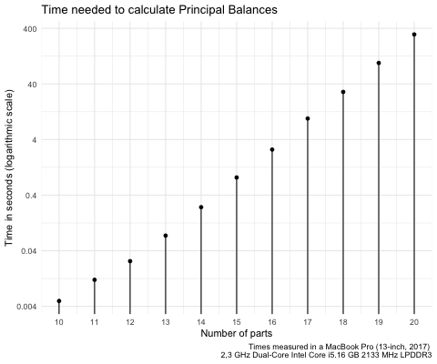

```{r setup, include = FALSE}
knitr::opts_chunk$set(
  collapse = TRUE,
  comment = "#>"
)
```

_Principal balances_ are defined as follows [@pawlowsky2011]:

> Given an $n$-sample of a $D$-part random composition, the set of Principal Balances (PB) is a set of $D-1$ balances satisfying  the following conditions:
> 
> * Each sample PB is obtained as the projection of a sample composition on a unitary composition or balancing element associated to the PB.
> * The first PB is the balance with maximum sample variance.
> * The $i$-th PB has maximum variance conditional to its balancing element being orthogonal to the previous 1st, 2nd, ..., $(i-1)$-th balancing elements.
>

Because of the large amount of possibilities, for a given compositional sample, finding the PB is a computational demanding task. @fernandez2017 proposed different approaches to deal with the calculation and approximation of such type of basis. `coda.base` implements all methods presented in [@fernandez2017]. 

To illustrate `coda.base` functionalities we will use the following dataset:

```{r}
library(coda.base)
X = parliament2017[,-1]
```

consisting of parties in the 2017 Catalan Parliament Elections.

## Exact Principal Balances

`coda.base` can calculate the PB with the function `pb_basis()`. Function `pb_basis()` needs the paramater `method` to be set. To obtain the PB users needs to set `method = "exact"`.

```{r}
B1 = pb_basis(X, method = "exact")
```

Where the obtained sequential binary partition can be summarised with the following sequential binary tree:

```{r}
plot(B1)
```

When `method` is set to `"exact"`, exhaustive search is performed to obtain the PB. The time needed to calculate the PB grows exponentially with respect the number of parts of `X`. Currently, exhaustive search can find the PB of a compositional data set with 20 parts in a reasonable ammount of time (5 minutes approximately).



```{r, eval=FALSE, results='hide', echo=FALSE}
library(tictoc)
library(ggplot2)
D = 10


time_ = sapply(5:20, function(D){
  print(D)
  x = matrix(rlnorm(100*D), ncol=D)
  a = tic()
  r = pb_basis(x, method = 'exact')
  b = toc()
  b$toc - b$tic
})
dplot = data.frame(
  parts = tail(5:20, 11),
  time = tail(time_, 11)
)
p = ggplot(data=dplot) +
  geom_point(aes(x=parts, y=time)) +
  geom_segment(aes(x=parts, xend =parts, y = 0, yend=time)) +
  labs(x = 'Number of parts', y = 'Time in seconds (logarithmic scale)', title = 'Time needed to calculate Principal Balances',
       caption = "Times measured in a MacBook Pro (13-inch, 2017) \n2,3 GHz Dual-Core Intel Core i5.16 GB 2133 MHz LPDDR3") +
  scale_x_continuous(breaks = tail(5:20, 11)) +
  scale_y_continuous(trans = 'log', breaks = c(0.004, 0.04, 0.4, 4, 40, 400), labels = c("0.004", "0.04", "0.4", 4, 40, 400)) +
  theme_minimal()
###
png('vignettes/time_pb.png', height = 400, pointsize = 20)
print(p)
dev.off()
```

##  Constrained PCs Algorithm

```{r}
B2 = pb_basis(X, method = 'constrained')
plot(B2)
```

##  Ward Method for Parts

```{r}
B3 = pb_basis(X, method = 'cluster')
plot(B3)
```

```{r, eval=FALSE}
hc = hclust_dendrogram(B1)
hcd = as.dendrogram(hc)
dd = dendro_data(hcd)
ggdendrogram(dd)
dd$segments = dd$segments %>%
  mutate(
    end_node = yend == 0
  )
  
p <- ggplot(dd$segments) + 
  geom_segment(aes(x = x, y = y, xend = xend, yend = yend, linetype = end_node))+
  geom_label(data = dd$labels, aes(x, y, label = label),
            hjust = 0.5, angle = 90, size = 4) +
  theme_void() + scale_linetype_discrete(guide=FALSE)
p

## Build tree
build_tree_order = function(B, ibalance){
  balance = B[,ibalance]
  if(sum(balance != 0) == 2){
    return(ibalance)
  }
  L = NULL; R = NULL
  left_ = balance < 0
  if(sum(left_) > 1){
    L = Recall(B, which(apply((B != 0 & left_) | (B == 0 & !left_), 2, all)))
  }
  right_ = balance > 0
  if(sum(right_) > 1){
    R = Recall(B, which(apply((B != 0 & right_) | (B == 0 & !right_), 2, all)))
  }
  return(unname(c(L, R, ibalance)))
}
ord_ = build_tree_order(B, which(apply(B != 0, 2, all)))
TREE = setNames(lapply(1:ncol(X), function(i) list('c' = i)), names(X)[ORDER])
for(i in ord_){
  balance = B[,i]
  name_ = paste(sort(names(balance)[balance != 0]), collapse = '_')
  name_left = paste(sort(names(balance)[balance < 0]), collapse = '_')
  name_right = paste(sort(names(balance)[balance > 0]), collapse = '_')
  l_node = list(
    list(
      name = name_,
      left = name_left,
      right = name_right,
      l = TREE[[name_left]]$c,
      r = TREE[[name_right]]$c,
      c = (TREE[[name_left]]$c+TREE[[name_right]]$c)/2
  ))
  names(l_node) = name_
  TREE = c(TREE, l_node)
}
nodes = sapply(ord_, function(i){
  balance = B[,i]
  paste(sort(names(balance)[balance != 0]), collapse = '_')
})
TREE = TREE[nodes]
lapply(TREE, as_tibble) %>% bind_rows()
for(node in rev(nodes)){
  TREE[[node]]
}

# lapply(nodes, function(name_){
#   tibble(
#     name = name_,
#     name_l = TREE[[name_]]$left,
#     name_r = TREE[[name_]]$right,
#     l = TREE[[name_]]$l,
#     r = TREE[[name_]]$r,
#     c = TREE[[name_]]$c,
#     var = var(H[,i])
#   )
# }) %>% bind_rows()


H = coordinates(X, B)
H_mean = colMeans(H)
H_var = apply(H, 2, var)

names(X)[ORDER]

l_nodes = lapply(rev(ord_), function(i){
  list(
    
    balance = B[,i],
    mean = boot::inv.logit(H_mean[i]),
    var = H_var[i]
  )
})
names(l_nodes) = sapply(l_nodes, function(x) paste(sort(names(x$balance)[x$balance != 0]), collapse = '_'))
l_nodes
```

```{r, include=FALSE}
library(coda.base)
X = iris[,1:4]
B = pb_basis(X, method = 'exact')
rownames(B) = names(X)
H = coordinates(X, B)
apply(H, 2, var)
```

```{r, include=FALSE}
plot(H[,1], H[,2])
```


```{r, include=FALSE}
lX = split(X, iris$Species)
m_ = lapply(lX, colMeans)
s_ = lapply(lX, cov)
S = cov(X)
S_ = replicate(3, S, simplify = FALSE)
```

```{r, include=FALSE}
Prob = mapply(function(m,s){
  mvtnorm::dmvnorm(X, m, s)
}, m_, S_)
```

```{r, include=FALSE}
B_1 = pb_basis(Prob, method = 'exact')
H_1 = coordinates(Prob, B_1)
plot(H_1, col = iris$Species)
```

```{r, include=FALSE}
B_2 = pc_basis(Prob)
H_2 = coordinates(Prob, B_2)
plot(-H_2, col = iris$Species)
```

```{r, include=FALSE}
library(fpc)
dp = discrproj(X, iris$Species)
plot(dp$proj[,1:2], col = iris$Species)
```


# References
